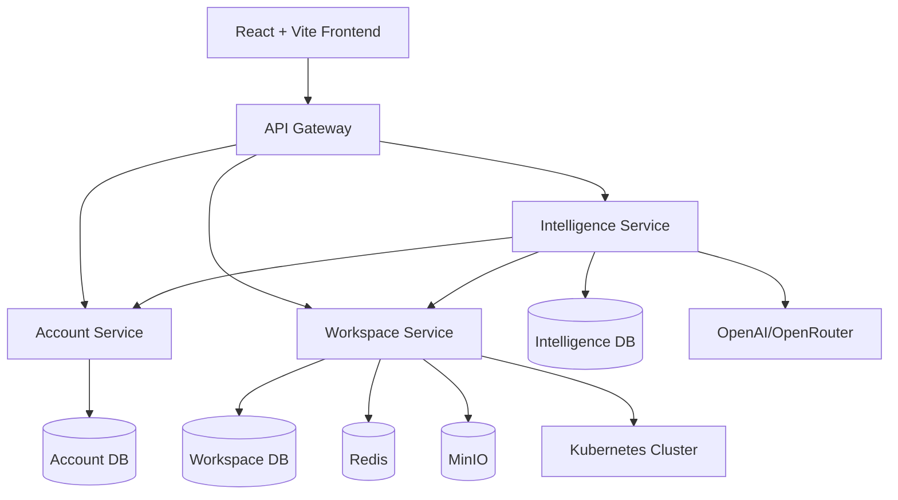
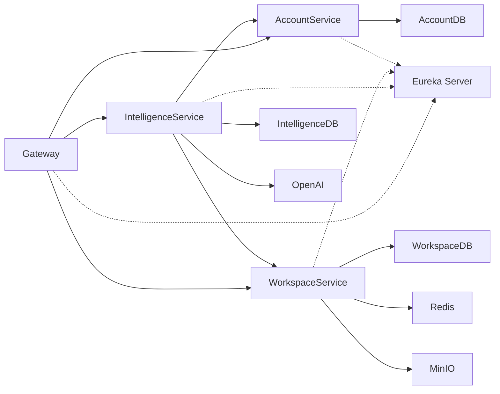
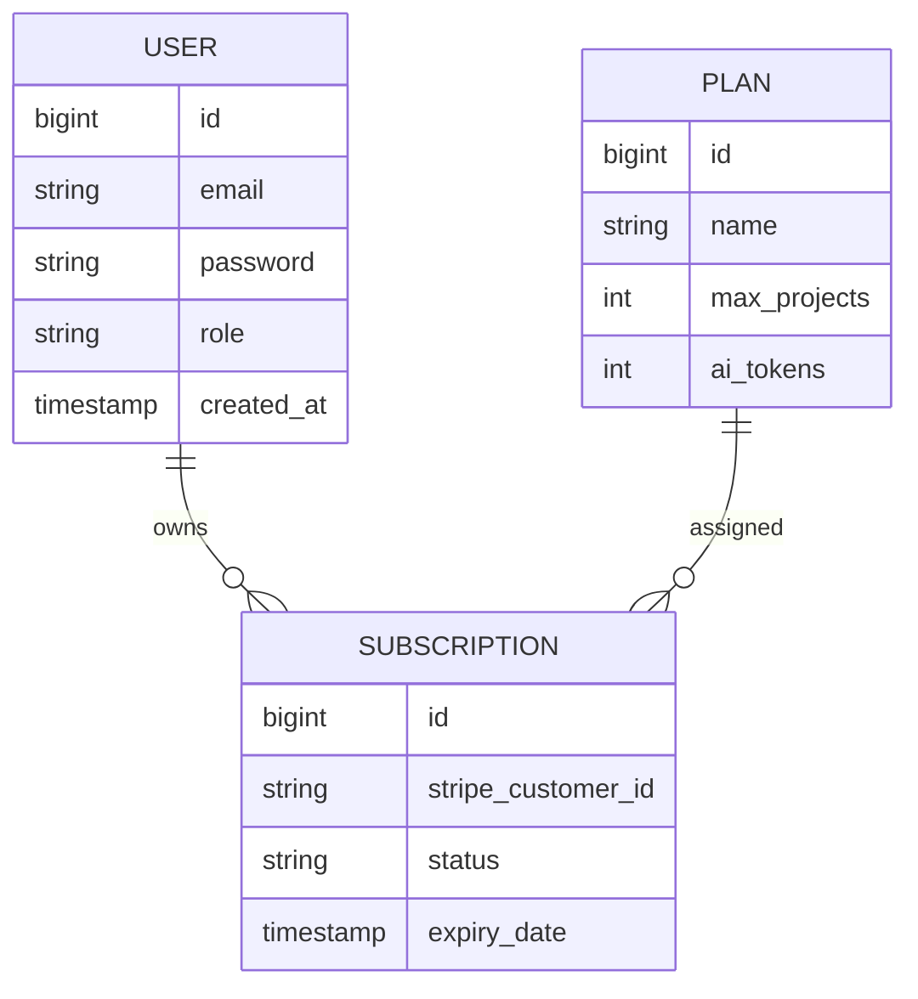
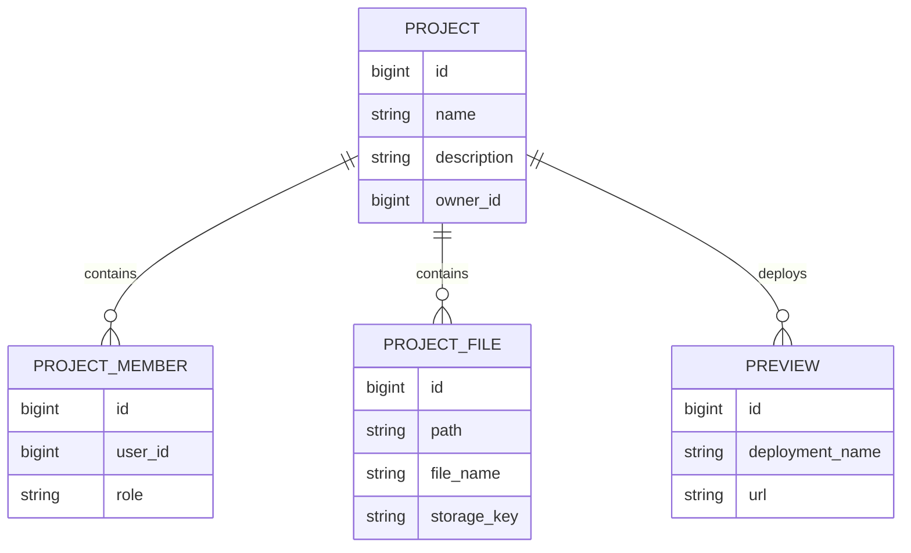
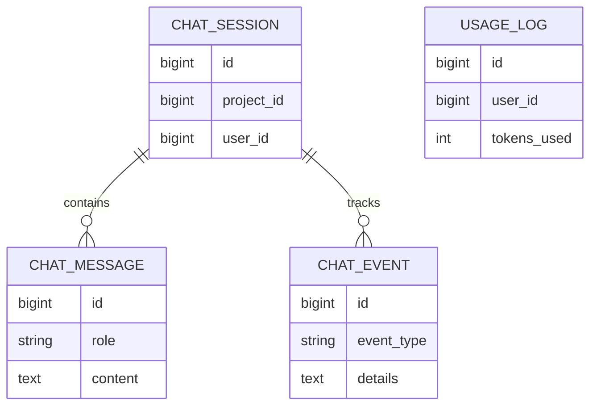
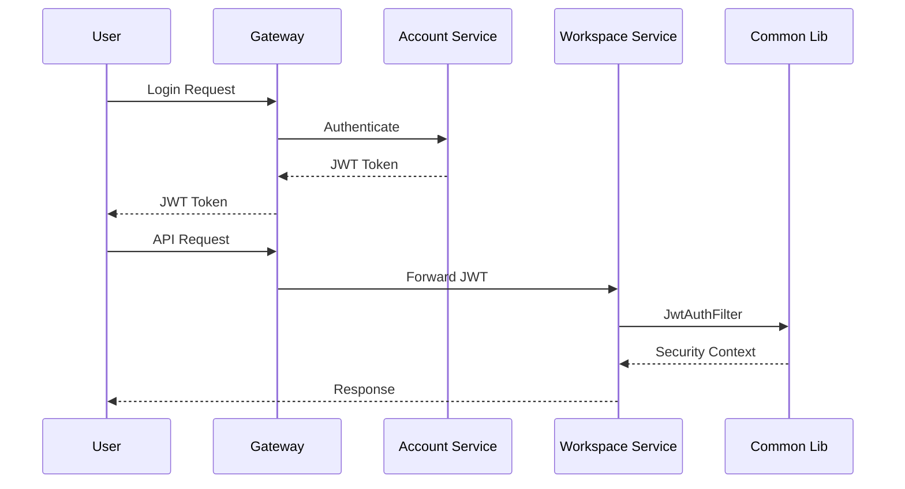
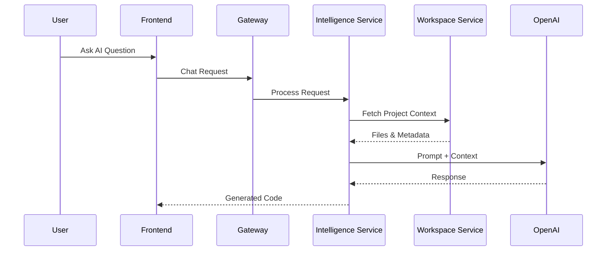
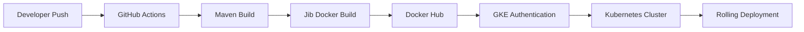
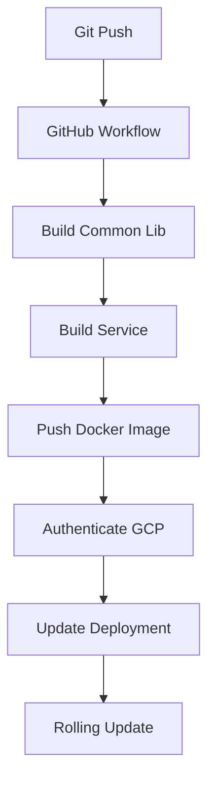

# 🚀 Distributed AI Project Companion

> A cloud-native AI-powered software development platform built with Spring Boot Microservices, Kubernetes, OpenAI, React, PostgreSQL, Redis, MinIO, and Google Kubernetes Engine (GKE).

---

# 📋 Table of Contents

* Overview
* System Architecture
* Microservices Architecture
* Technology Stack
* Database Design
* API Documentation
* Local Development Setup
* Docker Deployment
* Kubernetes Deployment
* CI/CD Pipeline
* Security Architecture
* Monitoring & Troubleshooting
* Future Roadmap

---

# 🎯 Overview

Distributed AI Project Companion enables developers to:

* Create and manage software projects
* Collaborate with team members
* Store and manage project files
* Generate code using AI
* Chat with project-aware AI assistants
* Deploy preview environments automatically
* Scale applications through Kubernetes

---

# 🏗️ System Architecture



---

# 🔧 Microservices Architecture



---

# 📦 Service Responsibilities

| Service              | Responsibility                   |
| -------------------- | -------------------------------- |
| Account Service      | Authentication, Users, Billing   |
| Workspace Service    | Projects, Files, Team Members    |
| Intelligence Service | AI Chat, Code Generation         |
| API Gateway          | Routing, Security                |
| Config Service       | Centralized Configuration        |
| Discovery Service    | Service Discovery                |
| Common Lib           | Shared DTOs, JWT, Feign Security |

---

# 🛠️ Technology Stack

## Backend

* Java 21
* Spring Boot 3
* Spring Security
* Spring Cloud
* Spring AI
* OpenFeign
* JPA / Hibernate
* MapStruct

## Frontend

* React
* TypeScript
* Vite
* TailwindCSS

## Storage

* PostgreSQL
* Redis
* MinIO

## Infrastructure

* Docker
* Kubernetes
* GKE
* NGINX Ingress

## CI/CD

* GitHub Actions
* Docker Hub
* Google Cloud Workload Identity Federation

---

# 🗄️ Database Design

## Account Service ER Diagram



---

## Workspace Service ER Diagram



---

## Intelligence Service ER Diagram



---

# 🔐 Security Architecture



---

# 🤖 AI Request Flow



---

# 🌐 API Documentation

## Authentication APIs

### Register

```http
POST /auth/register
```

Request

```json
{
  "email": "user@example.com",
  "password": "password"
}
```

Response

```json
{
  "id": 1,
  "email": "user@example.com"
}
```

---

### Login

```http
POST /auth/login
```

Response

```json
{
  "token": "jwt-token"
}
```

---

## Project APIs

### Create Project

```http
POST /api/projects
```

### Get Project

```http
GET /api/projects/{projectId}
```

### Delete Project

```http
DELETE /api/projects/{projectId}
```

---

## File APIs

### Upload File

```http
POST /api/projects/{projectId}/files
```

### Get File Tree

```http
GET /api/projects/{projectId}/tree
```

### Download File

```http
GET /api/projects/{projectId}/files/{fileId}
```

---

## AI APIs

### Create Chat Session

```http
POST /api/chat/sessions
```

### Send Message

```http
POST /api/chat/{sessionId}/message
```

### Generate Code

```http
POST /api/ai/generate
```

---

# 🚀 Local Development

## Build Common Library

```bash
cd common-lib
./mvnw clean install -DskipTests
```

## Start Backend Services

```bash
./mvnw spring-boot:run
```

## Start Frontend

```bash
cd project-companion-ui

npm install

npm run dev
```

---

# 🐳 Docker Deployment

## Build Image

```bash
./mvnw compile jib:dockerBuild
```

## Push Image

```bash
./mvnw compile jib:build
```

---

# ☸️ Kubernetes Deployment

## Create Namespaces

```bash
kubectl create namespace lovable-core

kubectl create namespace lovable-previews
```

## Deploy Infrastructure

```bash
kubectl apply -f k8s/databases/ -n lovable-core
```

## Deploy Services

```bash
kubectl apply -f k8s/services/ -n lovable-core
```

## Deploy Ingress

```bash
kubectl apply -f k8s/ingress.yaml -n lovable-core
```

---

# 🔄 Deployment Flow Diagram



---

# 🔄 CI/CD Pipeline



---

# 📊 Monitoring Commands

```bash
kubectl get pods -A
```

```bash
kubectl get svc -A
```

```bash
kubectl logs deployment/account-service -n lovable-core
```

```bash
kubectl rollout restart deployment/account-service -n lovable-core
```

---

# 🛣️ Future Roadmap

* Vector Database Integration
* RAG-based Code Generation
* Multi-Agent AI Workflows
* Real-time Collaboration
* Prometheus Monitoring
* Grafana Dashboards
* OpenTelemetry Tracing
* Multi-Region Kubernetes Deployment
